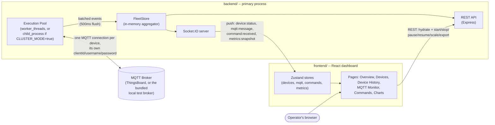
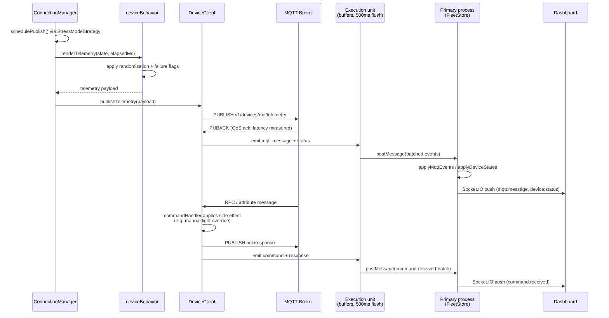
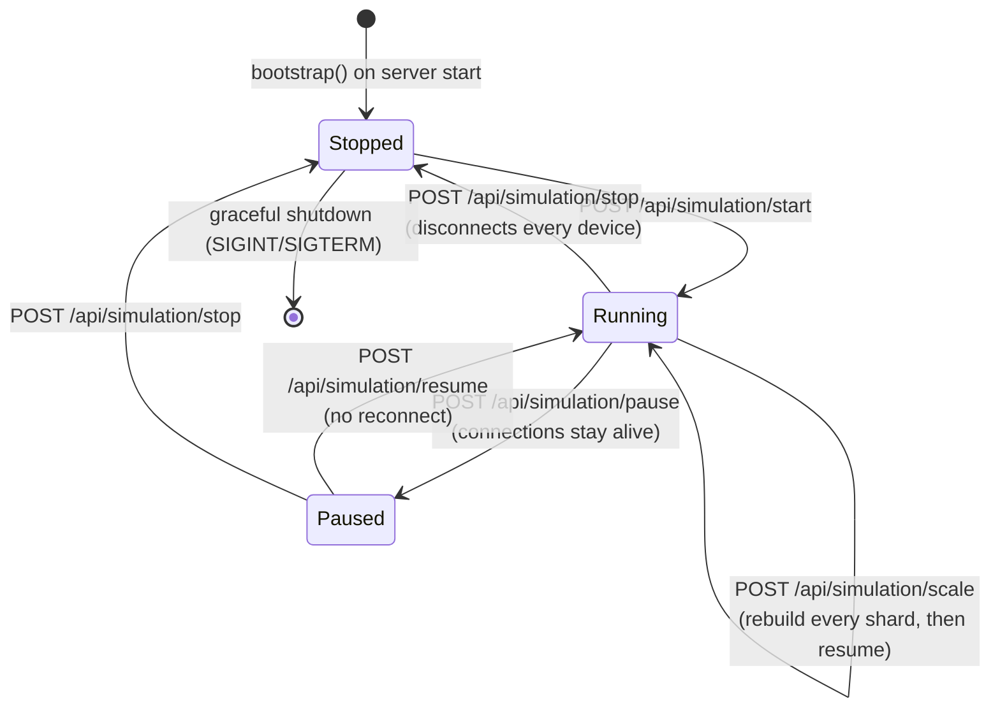

# NLC MQTT Stress Testing Framework

A digital-twin MQTT device simulator that impersonates fleets of NLC (Network Lighting Controller)
devices talking to ThingsBoard, so custom ThingsBoard dashboards can be stress-tested under
realistic, production-like traffic.

## Status

This repository is being built in phases:

- **Phase 1 -- Backend simulation engine (done, `backend/`)**: per-device MQTT connections,
  realistic telemetry generation, RPC/attribute command handling, worker-thread fleet management,
  live metrics, Socket.IO push events, and a REST control API.
- **Phase 2 -- Frontend dashboard (done, `frontend/`)**: a React/Vite/Tailwind/HeroUI real-time
  monitoring UI -- KPI overview, live device table, a Wireshark-style MQTT monitor, a live command
  panel, and a full chart set -- consuming the Phase 1 API over Socket.IO (live) and REST (initial
  hydration + control actions). Verified end-to-end in a real browser (Playwright), including live
  push updates with zero page reloads.
- **Phase 3 -- Remaining stress modes, pause/resume, correlation, export polish (done)**: all ten
  `SIMULATION_MODE` strategies are now implemented, a real pause/resume (connections stay alive,
  unlike stop), command-\>response correlation in the Commands panel, and `logs`/`metrics` export
  endpoints.
- **Phase 4 -- Single-host multi-process mode (done)**: `CLUSTER_MODE=true` shards devices across
  forked OS child processes instead of `worker_threads` -- real crash isolation (verified by
  killing a shard process directly and confirming the API/dashboard stay up) without adding Redis
  or any multi-host infrastructure. `CLUSTER_MODE=false` (default) keeps the original
  `worker_threads` behavior unchanged. A true multi-host/Redis-backed cluster remains out of scope
  -- see Roadmap.
- **Phase 5 -- ThingsBoard payload/dashboard parity + device provisioning (done)**: the telemetry
  shape, fault-flag set, and command handling were brought in line with a real ThingsBoard tenant's
  dashboards and device widgets (reverse-engineered from a live dashboard export) -- see
  [ThingsBoard payload/dashboard compatibility](#thingsboard-payloaddashboard-compatibility) below.
  `automation/` (Playwright) provisions MQTT Basic credentials on ThingsBoard for every device in
  `devices.json`, and `backend/scripts/import-devices.ts` generates `devices.json` (with per-device
  `ratedWattage`) from a CSV export. The frontend gained a **Device History** page (master-detail:
  full stats + recent activity per device) and Light-Mode/Status filters on the Devices page.

## Architecture

Deeper, layer-specific diagrams live in [`backend/docs/ARCHITECTURE.md`](backend/docs/ARCHITECTURE.md)
and [`frontend/docs/ARCHITECTURE.md`](frontend/docs/ARCHITECTURE.md). The system-level picture:



```
backend/
  src/
    config/        env loading + zod validation -> typed AppConfig
    models/        Device, Telemetry, Command, Metrics, StressMode, worker message types
    logger/        pino factory -- mqtt.log, commands.log, errors.log, system.log, performance.log
    telemetry/      payload-template loader, AUTO_TIMESTAMP substitution, randomization engine
    simulator/      per-device behavior model (voltage/current/energy/on-dim-off/failures),
                    stress-mode scheduler -- all ten SIMULATION_MODE strategies (constant,
                    ramp-up, ramp-down, random-interval, spike, burst, peak-hour, night,
                    scheduled, chaos) in simulator/stressModes/index.ts
    mqtt/          per-device MQTT client wrapper (its own clientId/username/password --
                    no shared client), connection manager, publish/latency tracking
    rpc/           parses RPC (v1/devices/me/rpc/request/+) and shared-attribute commands
                    (v1/devices/me/attributes -- e.g. ThingsBoard's built-in Turn On/Off/Dim
                    widget), applies simulated side effects, builds acks/response, and computes
                    a stateChange diff (what the command actually changed) for the dashboard
    workers/       execution pool -- each unit owns a shard of devices and runs MQTT + simulator
                    for them; a FleetStore aggregates everything for the API. BaseExecutionPool
                    (executionPoolBase.ts) holds all the orchestration logic, transport-agnostic
                    over PoolUnit (poolUnit.ts); workerPool.ts (worker_threads, default) and
                    processPool.ts (child_process, CLUSTER_MODE=true) are both thin instantiations
                    of it. pool.ts exports whichever is active. deviceRunner.ts likewise holds the
                    shared per-unit buffering/flush logic behind deviceWorker.ts/deviceProcess.ts
    websocket/      Socket.IO server -- push-only device:status / mqtt:message /
                    command:received / metrics:snapshot events
    api/           Express REST -- health, config, devices, metrics, simulation control, export
    utils/         device loading/selection, random helpers, csvParser.ts (RFC4180), dot-path get/set
    app.ts         Express app assembly
    server.ts      entrypoint: HTTP + Socket.IO + worker pool bootstrap + graceful shutdown
  devices.json          device credentials (clientId/userName/password/ratedWattage per device)
  payload-template.json telemetry shape + randomization ranges/failure probabilities
  .env.example           every configurable setting, documented
  scripts/local-broker.ts   a throwaway local MQTT broker for development (no real
                             ThingsBoard broker required to test the simulator logic)
  scripts/import-devices.ts generates devices.json from a CSV export (device name + Wattage
                             columns) -- `npm run import:devices` (see "Generating devices.json")

automation/     Playwright utility (separate npm project, not part of the backend/frontend
                workspaces) that logs into ThingsBoard once and configures MQTT Basic
                credentials (clientId/userName/password) for every device in
                backend/devices.json -- see "Provisioning devices on ThingsBoard"

frontend/
  src/
    types/          hand-written TS types mirroring the backend models (kept in sync manually)
    websocket/      socketClient.ts -- singleton socket.io-client instance
    store/          Zustand stores for push-driven live data: useDeviceStore, useMqttMonitorStore,
                    useCommandStore, useMetricsStore (ring buffers / latest-value + history)
    hooks/          useSocketSubscriptions (the only place that touches the socket) + React Query
                    hooks for initial hydration (devices/mqtt/commands/metrics/config) and
                    simulation control mutations (start/stop/scale)
    components/     StatTile, ConnectionStatusBadge, LightModeBadge (On/Dim NN%/Off),
                    SocketConnectionIndicator, SimulationControls, ExportButtons, ThemeToggle
    charts/         TimeSeriesChart.tsx -- one reusable Recharts line chart, single axis only
    tables/         DataTable.tsx (shared search/sort/pagination chrome over a plain <table>,
                    driven by TanStack Table's headless row model) + DeviceTable (Light
                    Mode/Status filters, energy/wattage columns) / MqttMonitorTable /
                    CommandsTable (expandable payload/response, a "Changes" column showing the
                    command's stateChange diff) column definitions
    pages/          OverviewPage, DevicesPage, DeviceHistoryPage (master-detail: searchable
                    device list -> full stats + recent MQTT/command activity for the selected
                    device, from the same live ring buffers as the MQTT Monitor/Commands pages --
                    not a persisted long-term log), MqttMonitorPage, CommandsPage, ChartsPage
    layouts/        DashboardLayout.tsx -- header (nav, sim status, controls, export, theme) + outlet
  .env.example      VITE_API_URL, VITE_SOCKET_URL
```

### How a publish tick works

1. `ConnectionManager` (one per worker thread) staggers device startup in `DEVICE_BATCH_SIZE`
   batches and schedules each device's next publish via a `StressModeStrategy`
   (`SIMULATION_MODE`).
2. On each tick, `simulator/deviceBehavior.ts` advances that device's simulated physical state and
   renders a payload from `payload-template.json`. Absent a manual override, each device's
   on/dim/off mode is deterministic per `clientId` + the current 5-minute time window (a
   MurmurHash3-style hash, `assignLightMode` in `models/device.ts`) -- fleet-wide this holds a
   ~50% on / 25% dim / 25% off split that **reshuffles which devices are in which bucket every 5
   minutes**, rather than a fixed day/night schedule or a permanently-fixed per-device assignment.
   `dimLevel` (0-100, the brightness percentage) drives `activePower`/`supplyCurrent` scaled by
   that device's own `ratedWattage` (from `devices.json`, sourced from the CSV's Wattage column),
   so different devices draw genuinely different, realistic power -- not one shared constant.
   Voltage jitters continuously; energy counters (`CumKwh`/`cum_kWh`, lifetime; `Daily_kWh`,
   resets at local midnight) only ever accumulate.
3. `telemetry/randomizer.ts` applies the template's configured ranges/jitter and low-probability
   failure flags (photocell/lamp/EM/RTC/relay faults, communication failures, day-burner/last-gasp
   flags) when `ENABLE_RANDOMIZATION=true`.
4. The device's own `mqtt.js` client publishes to `MQTT_TOPIC` and tracks publish latency via the
   QoS ack callback. `lampStatus` publishes `1` whenever a device is actively sending data
   (mirroring real hardware: "controller is powered and communicating" -- distinct from whether the
   lamp is lit, which is `actualLightState`/`dimLevel`).
5. Incoming commands are parsed in `rpc/` from two different shapes ThingsBoard actually sends --
   RPC (`v1/devices/me/rpc/request/+`, e.g. `setLightState`/`setDimLevel`) and shared attributes
   (`v1/devices/me/attributes`, the shape ThingsBoard's built-in Turn On/Off/Dim device widget
   pushes: `targetCommand`/`targetLightCommand` with a `LevelState` value and its own
   `expiration`, or `IntegerState: -1` to cancel). Either path sets a **manual override** that
   takes precedence over the fleet's on/dim/off assignment until it expires, acknowledged back to
   the broker (RPC only) and logged, with a `stateChange` diff (what actually changed, e.g.
   `dimLevel 0->46`) attached to the command event for the dashboard's Commands page.
6. Each worker batches device-status/MQTT-traffic/command events and flushes them to the main
   thread every 500ms (not per-message) so thousands of devices don't flood the main event loop.
   The main thread's `FleetStore` aggregates everything; the REST API and Socket.IO layer both
   read from it.
7. `POST /api/simulation/pause` halts every device's publish timers but leaves MQTT connections
   open; `resume` reschedules them without a reconnect -- distinct from `stop`, which fully
   disconnects. Ramp-based strategies (`ramp-up`/`ramp-down`) compute their curve from elapsed
   wall-clock time since simulation start, so a pause/resume cycle doesn't freeze that clock.



### `CLUSTER_MODE`

By default (`CLUSTER_MODE=false`) each shard runs in a `worker_thread` -- real OS-thread
parallelism, all within one process. Set `CLUSTER_MODE=true` and each shard instead runs in a
forked OS **child process** (`node --require tsx/cjs src/workers/deviceProcess.ts` in dev,
communicating with the primary over IPC). The primary process still owns the sole API/Socket.IO
server and `FleetStore` either way -- the dashboard's API surface doesn't change.

What `CLUSTER_MODE=true` actually buys: if a shard process crashes (uncaught exception, OOM), it
can't corrupt the primary's memory or event loop the way a sufficiently bad worker_thread failure
theoretically could, and each shard can be supervised/restarted independently (e.g. via PM2). It
does **not** buy scale-out across hosts -- that needs Redis-backed shared state and a Socket.IO
Redis adapter, which this project doesn't include (see Roadmap). A crashed shard's devices are
frozen at their last known status in `/api/devices` until you call `POST /api/simulation/scale`
(which tears down and rebuilds every shard) or `start`/`stop`.

Note: `child_process.fork()` is used, not Node's `cluster` module -- `cluster` is specifically for
sharing one listening TCP/HTTP handle across processes (round-robin load-balancing incoming
connections), which isn't this pattern (only the primary owns the API/Socket.IO server).
`child_process.fork()` is the correct primitive for "spawn N helper processes with an IPC channel."

### Simulation lifecycle



## Configuration

Everything is controlled by `backend/.env` (copy from `backend/.env.example`) -- no hardcoded
values. Key groups:

| Group | Vars |
|---|---|
| MQTT broker | `MQTT_HOST`, `MQTT_PORT`, `MQTT_PROTOCOL`, `MQTT_USERNAME`, `MQTT_PASSWORD`, `MQTT_TOPIC`, `MQTT_QOS`, `MQTT_RETAIN`, `MQTT_EXTRA_SUBSCRIBE_TOPICS` |
| Device fleet | `DEVICE_LIMIT`, `DEVICE_SELECTION_MODE`, `DEVICE_BATCH_SIZE`, `ENABLE_RANDOMIZATION` |
| Simulation | `PUBLISH_INTERVAL_MS`, `PAYLOAD_MODE`, `SIMULATION_MODE`, `MAX_MESSAGES_PER_SECOND`, `START_DELAY`, `RAMP_UP_TIME`, `RAMP_DOWN_TIME`, `HEARTBEAT_INTERVAL` |
| Stress-mode tuning | `SPIKE_INTERVAL_MS`, `SPIKE_DURATION_MS`, `SPIKE_FACTOR`, `BURST_SIZE`, `BURST_QUIET_MS`, `PEAK_HOUR_START`, `PEAK_HOUR_END`, `PEAK_HOUR_RATE_MULTIPLIER`, `NIGHT_RATE_MULTIPLIER`, `CHAOS_MIN_FACTOR`, `CHAOS_MAX_FACTOR` |
| Feature toggles | `ENABLE_RECONNECT`, `ENABLE_RPC`, `ENABLE_ATTRIBUTE_UPDATES`, `ENABLE_LOGGING`, `ENABLE_WEBSOCKET`, `ENABLE_UI`, `LATENCY_TRACKING` |
| MQTT client behavior | `COMMAND_TIMEOUT`, `KEEPALIVE`, `CLIENT_CLEAN_SESSION`, `AUTO_RECONNECT`, `RECONNECT_PERIOD` |
| Concurrency | `WORKER_COUNT`, `CLUSTER_MODE` |
| Servers | `SOCKET_PORT`, `API_PORT` |
| Logging | `LOG_LEVEL` |
| Metrics/export | `METRICS_INTERVAL`, `CSV_EXPORT`, `JSON_EXPORT` |

`devices.json` holds device credentials (`clientId`, `userName`, `password`, optional
`ratedWattage` per device, each connecting independently -- exactly like real hardware).
`ratedWattage` (falls back to 70W if absent) drives that device's simulated power/current draw --
see "Generating `devices.json` from a CSV" under Device Provisioning. It supports any number of
devices; how many actually run is controlled purely by `DEVICE_LIMIT` and `DEVICE_SELECTION_MODE`
(sequential/random/shuffle/round-robin/random-batch) -- no code changes needed to go from 10 to
10,000+ devices.

`payload-template.json` holds the telemetry shape (with `"ts": "AUTO_TIMESTAMP"` resolved at
publish time) plus a `randomization` block of numeric ranges/jitter and failure probabilities
applied per publish tick.

### `SIMULATION_MODE` reference

| Mode | Behavior |
|---|---|
| `constant` | Publishes every `PUBLISH_INTERVAL_MS`, no variation. |
| `ramp-up` | Interval shrinks linearly from 3x base to base over `RAMP_UP_TIME`. |
| `ramp-down` | Interval grows linearly from base to 3x base over `RAMP_DOWN_TIME`. |
| `random-interval` | Interval jitters +/-50% around base each tick. |
| `spike` | Base rate normally; every `SPIKE_INTERVAL_MS`, a `SPIKE_DURATION_MS` window publishes `SPIKE_FACTOR`x faster. |
| `burst` | Fires `BURST_SIZE` messages back-to-back, then idles for `BURST_QUIET_MS`, repeating. |
| `peak-hour` | Publishes `PEAK_HOUR_RATE_MULTIPLIER`x faster during `[PEAK_HOUR_START, PEAK_HOUR_END)`. |
| `night` | Publishes `NIGHT_RATE_MULTIPLIER`x faster during 18:00-06:00. Independent of the device on/dim/off model below -- this only affects publish *rate*, not any device's light state. |
| `scheduled` | Combines peak-hour and night into one full day/night rate curve. |
| `chaos` | Interval randomized each tick between `base * CHAOS_MIN_FACTOR` and `base * CHAOS_MAX_FACTOR` -- wider and wilder than `random-interval`. |

`spike` and `burst` are pure functions of elapsed time (not per-device counters), so the whole
fleet spikes/bursts and quiets in sync -- a synchronized fleet-wide pattern is the point of a
load-test spike/burst mode, and it produces a much more distinct, observable effect on the broker
than independent per-device timers would.

## ThingsBoard payload/dashboard compatibility

The telemetry shape, fault-flag set, and on/dim/off model were reverse-engineered against a real
ThingsBoard tenant's dashboards (an exported dashboard's widget definitions) and a downstream
EnergySavingsService, not designed in isolation -- a few things are non-obvious as a result:

- **`lampStatus` is always `1`** whenever a device is actively publishing -- it means "controller
  is powered and communicating," mirroring real hardware, not "is the lamp lit." Whether the lamp
  is on/dim/off is entirely carried by `actualLightState` (0-100, see below). This was a deliberate
  reversal mid-project (see git history on `simulator/deviceBehavior.ts`) after first tying
  `lampStatus` to the light state and then to the real device widget contract -- if this needs to
  change again, grep the dashboard's `entitiesQuery` widget filters first, not just the telemetry.
- **on/dim/off classification contract** (matches the dashboard's own widget filters exactly):
  `actualLightState == 100` -> ON, `lampStatus == 0` -> OFF (never true in this simulator, see
  above -- the dashboard's OFF bucket is intentionally unreachable here), `0 < actualLightState <
  100` -> DIM.
- **Duplicate/aliased telemetry keys** exist because different consumers expect different casing:
  `CumKwh` (original) and `cum_kWh` (what the EnergySavingsService reads) carry the same value;
  `Daily_kWh` (note the casing -- lowercase `k`) is a separate midnight-resetting counter, not a
  rename of the lifetime one.
- **`dailyConsumption`/`weeklyConsumption`/`monthlyConsumption`** are telemetry keys real dashboard
  widgets read, but they're computed and written *by* the EnergySavingsService (from `cum_kWh`
  deltas), not something this simulator publishes directly.
- **`Wattage`** is published once per connection as a client-side MQTT **attribute**
  (`v1/devices/me/attributes`, not telemetry) -- the EnergySavingsService needs it to compute
  expected consumption, and it's a static device characteristic, not a reading.
- **Command handling** covers both shapes ThingsBoard actually sends for light control (RPC and
  the shared-attribute `targetCommand`/`targetLightCommand` the built-in device widget uses) -- see
  step 5 of "How a publish tick works" above. A command that doesn't match either shape (an
  `Invoke`/`currentTime` attribute sync, for instance) is safely ignored, not an error.

## Running

Prerequisites: Node.js LTS.

```bash
cd backend
npm install
cp .env.example .env   # edit MQTT_HOST/PORT etc. to point at your ThingsBoard broker
npm run dev             # tsx watch, hot-reloads on save
```

No ThingsBoard broker yet? Run the bundled throwaway broker in another terminal and leave
`.env` pointed at `localhost:1883`:

```bash
npm run broker:dev
```

Production build:

```bash
npm run build
npm start
```

### Frontend dashboard

```bash
cd frontend
npm install
cp .env.example .env   # VITE_API_URL / VITE_SOCKET_URL -- defaults match the backend's defaults
npm run dev             # Vite dev server on http://localhost:5173
```

Open `http://localhost:5173` with the backend (and a broker) running. The dashboard connects to
Socket.IO immediately (see the "Live" indicator in the header) and REST-hydrates the device table,
MQTT monitor, command panel, and metrics before the socket's own initial snapshot arrives. No
polling anywhere -- every panel updates by socket push.

Production build: `npm run build` (outputs to `frontend/dist/`), then serve it with any static
file server pointed at the deployed backend's `VITE_API_URL`/`VITE_SOCKET_URL`.

### Verifying it's working

- `GET http://localhost:4000/health`
- `GET http://localhost:4000/api/devices` -- paginated device table (status, voltage, latency, counters...)
- `GET http://localhost:4000/api/metrics/snapshot` -- live fleet metrics
- `GET http://localhost:4000/api/mqtt/messages` / `GET http://localhost:4000/api/commands` -- recent
  traffic/command history (commands include the correlated `response` payload, if any, and a
  `stateChange` diff of what the command actually changed on the device)
- `POST http://localhost:4000/api/simulation/start|stop|pause|resume|scale`
- `GET http://localhost:4000/api/export/csv|json|metrics|logs`
- Socket.IO on `ws://localhost:4001` -- subscribe to `device:status`, `mqtt:message`,
  `command:received`, `metrics:snapshot` (push-only, no polling)
- Structured logs land in `backend/logs/{mqtt,commands,errors,system,performance}.log`

## Device provisioning

Two separate concerns: getting device *records* into `devices.json`, and getting matching MQTT
*credentials* configured on the ThingsBoard side so the simulator can actually authenticate.

### Generating `devices.json` from a CSV

```bash
cd backend
npm run import:devices                      # reads ../NLC Test Data.csv by default
npm run import:devices -- --csv path/to.csv  # or point at a different file
```

Expects a `Name` (or `Device Name`) column for `clientId`, and an optional `Wattage` column that
becomes each device's `ratedWattage` (drives its simulated power/current draw). Validates and
dedupes rows, skips/warns on empty names or invalid wattage, and overwrites `devices.json` with
`{clientId, userName: "NLC", password: "cimcon", ratedWattage?}` entries. To add more devices
later without re-running the whole import, append entries to `devices.json` directly in the same
shape (see the entries already there for the exact format).

### Provisioning MQTT credentials on ThingsBoard

`devices.json` having the right credentials locally doesn't mean ThingsBoard will accept them --
each device entity on ThingsBoard needs its MQTT Basic credentials (Client ID/Username/Password)
configured to match. `automation/` is a Playwright script that does this for every device in
`backend/devices.json`, one after another, logging in once:

```bash
cd automation
cp .env.example .env   # TB_BASE_URL/TB_USERNAME/TB_PASSWORD -- point at your ThingsBoard instance
npm install
npm run configure-credentials                  # every device in devices.json
npm run configure-credentials -- --start 501   # only device #501 onward (e.g. after adding more)
npm run configure-credentials -- --start 501 --end 600
```

Searches each device by exact name, opens Manage Credentials, switches to MQTT Basic only if it
isn't already, fills in Client ID/Username/Password, and saves. A single device failing (not
found, UI timeout, etc.) is logged and screenshotted to `automation/screenshots/`, never aborts
the run -- it always processes every device and reports `N Successful / N Failed` at the end.

## Scaling / load testing

1. Populate `devices.json` with as many device credentials as you need to simulate (matching your
   ThingsBoard provisioned devices) -- see "Device provisioning" above.
2. Set `DEVICE_LIMIT` to how many of them should actually run this session.
3. Tune `WORKER_COUNT` to your CPU core count -- devices are sharded round-robin across workers,
   each worker owning independent MQTT connections.
4. Tune `PUBLISH_INTERVAL_MS`, `MAX_MESSAGES_PER_SECOND`, `DEVICE_BATCH_SIZE`, `RAMP_UP_TIME` to
   shape how aggressively the fleet ramps up, to avoid overwhelming the broker or your own
   network stack during a connection storm.
5. Watch `GET /api/metrics/snapshot` (or the Overview/Charts pages in the dashboard) for CPU/RAM,
   messages/sec, latency, dropped messages, and reconnects while scaling up.

## Troubleshooting

- **`EADDRINUSE` on startup**: another instance (or an orphaned process from a previous run) is
  already bound to `API_PORT`/`SOCKET_PORT`. Stop it or change the port in `.env`.
- **`npm start` runs stale behavior after you changed `src/` or `.env`**: `npm start` runs
  `node dist/server.js` -- the *compiled* build, not live source. `.env` is only read once at
  process startup (`tsx watch` doesn't restart on `.env` changes, it only watches `.ts` files), and
  `dist/` is only as fresh as your last `npm run build`. If behavior doesn't match what's in
  `src/`, rebuild (`npm run build`) and restart the process -- don't assume the code is wrong
  before checking whether it's actually running.
- **Devices never reach `connected`**: check `MQTT_HOST`/`MQTT_PORT`/`MQTT_PROTOCOL` and that the
  broker accepts the `clientId`/`userName`/`password` combinations in `devices.json`. Note that
  `DeviceClient`'s error handler doesn't currently log the underlying MQTT error to
  `logs/errors.log` (it only tracks a status flag) -- to see the actual reason, test a device's
  credentials directly: `node -e "require('mqtt').connect('mqtt://HOST:PORT', {clientId, username,
  password}).on('connect', () => console.log('ok')).on('error', e => console.log(e.message))"`. A
  `connack timeout` (TCP connects, broker never acks) usually means the broker/transport is
  overloaded or down, not a config problem -- a `Connection refused: Not authorized` means bad
  credentials.
- **`Configuration validation failed`**: `.env` has an invalid value for one of the typed/enum
  vars (e.g. `MQTT_PROTOCOL` must be one of `mqtt|mqtts|ws|wss`); the console error lists the
  offending field(s).
- **Worker threads/processes failing to start in dev mode**: both `worker_threads` and
  `CLUSTER_MODE=true`'s forked processes run with `--require tsx/cjs` so they can execute `.ts`
  files directly under `tsx watch`; make sure `tsx` is installed (it's a devDependency) and hasn't
  been pruned.

## Roadmap (Phase 6)

- **True multi-host clustering**: `CLUSTER_MODE` (Phase 4) is single-host only -- a shared state
  layer (e.g. Redis) so multiple *hosts'* `FleetStore`s can aggregate together, a Socket.IO Redis
  adapter for cross-host broadcast, and a load-balancing entrypoint in front of multiple primaries,
  would be needed to genuinely scale out past one machine. Best designed against a real deployment
  target rather than speculatively.
- A crashed shard's devices freeze at their last known state in `/api/devices` rather than being
  reactively marked `disconnected`/`error` -- true of both `worker_threads` and `CLUSTER_MODE`
  today; `POST /api/simulation/scale` is the current recovery path.
- Ramp-based strategies (`ramp-up`/`ramp-down`) don't freeze their elapsed-time clock across a
  pause/resume cycle -- a small follow-up if that matters in practice.
- Bundle size: the frontend production build is a single ~245KB gzipped chunk (HeroUI + Recharts +
  TanStack Table). Fine for this use case, but code-splitting by route would help if it grows.
- `dbCount` (a "day-burner" event *count* some dashboard widgets read) isn't published -- unlike
  the other fault flags added in Phase 5, its exact semantics weren't clear enough to fake
  confidently; add it once someone can specify what it should count.
- Device History's "recent activity" is genuinely just a window into the shared, fleet-wide,
  in-memory ring buffers (500 MQTT events / 200 commands total, not per-device) -- with hundreds of
  devices, any single device's own recent activity can scroll out of that window within a minute or
  two. True long-term per-device history would need a real time-series store; not built
  speculatively.
