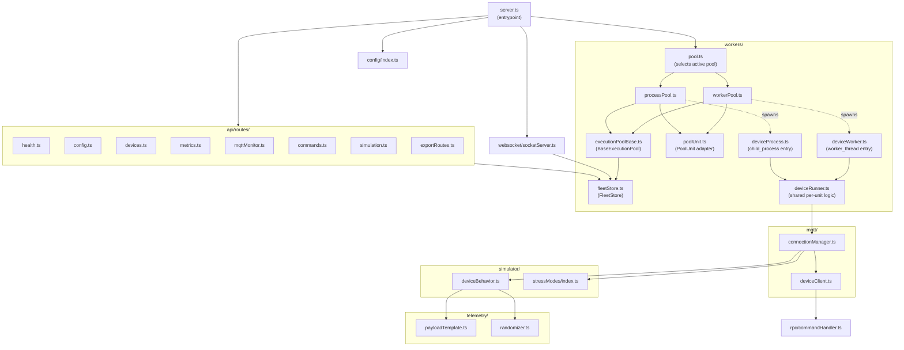
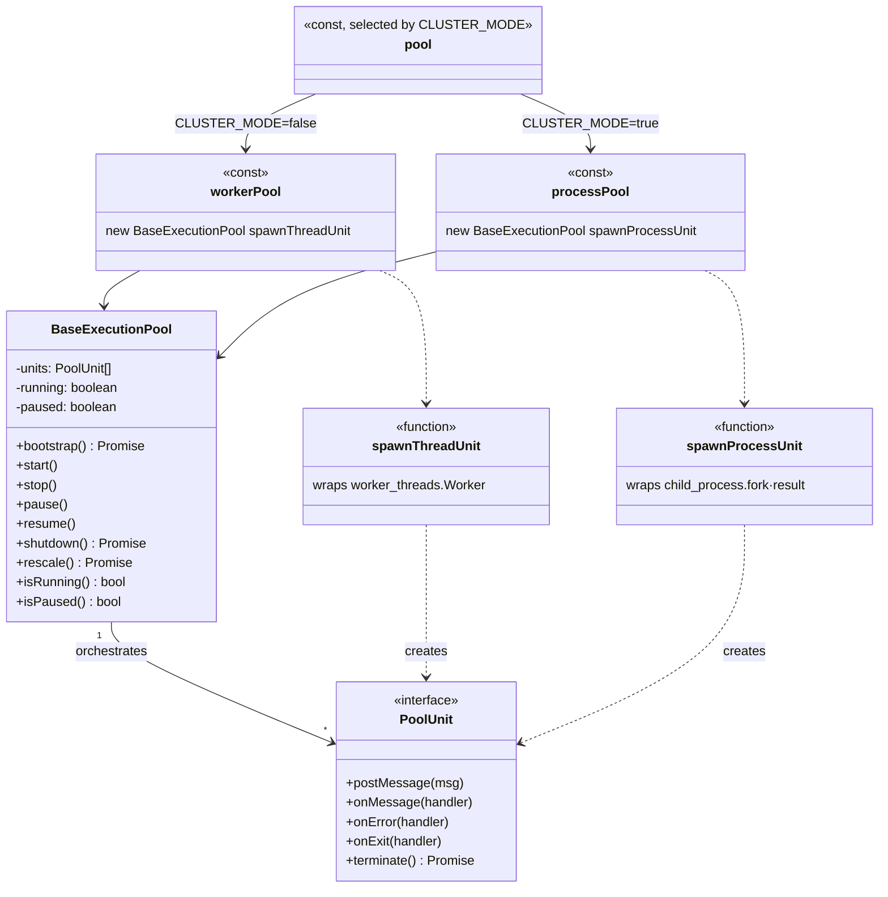
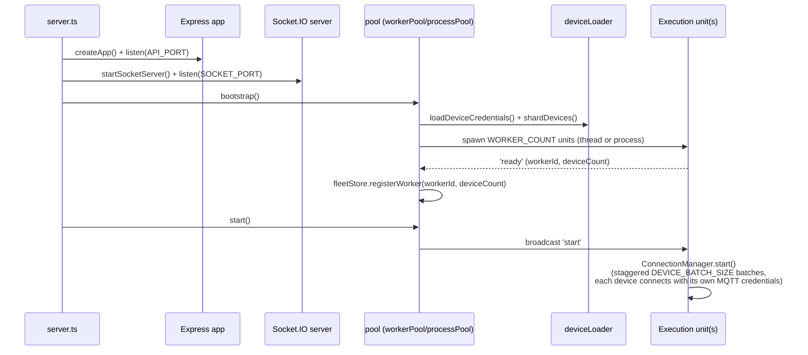
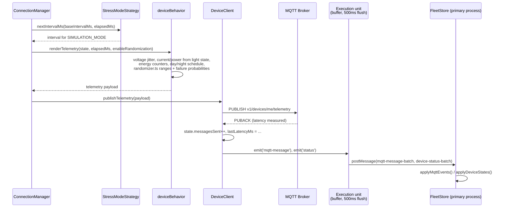
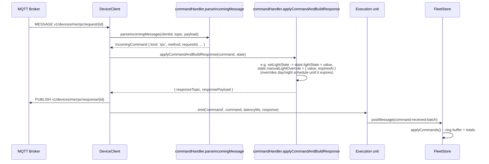
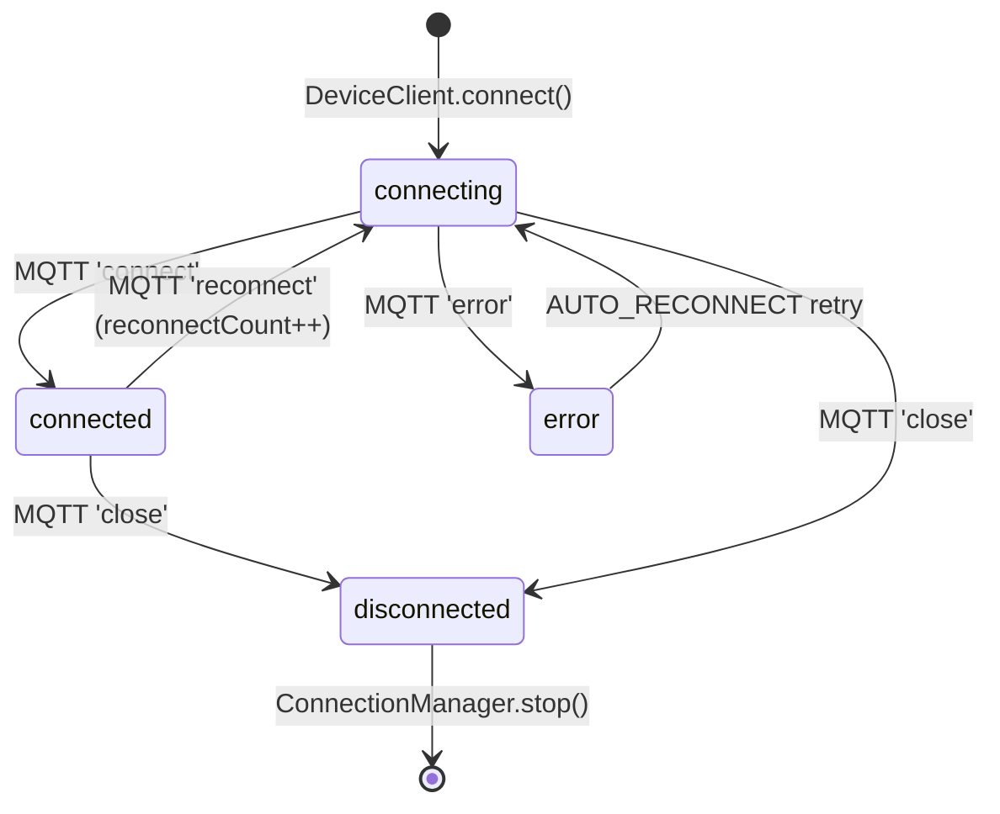
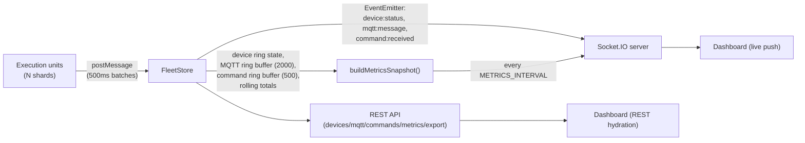

# Backend Architecture

The backend is a Node.js/TypeScript MQTT device simulation engine: it connects a fleet of
simulated NLC controllers to an MQTT broker (ThingsBoard or a local test broker), publishes
realistic telemetry, responds to RPC/attribute commands, and exposes everything it observes over a
REST API and Socket.IO for the dashboard in `frontend/`.

See the [root README](../../README.md) for how to run it and the full `.env` reference. This
document is the internal architecture: module structure, execution model, and the main request/
event flows, as Mermaid diagrams.

## Module structure

Dashed arrows are process/thread spawns (`new Worker(...)` or `child_process.fork(...)`); solid
arrows are ordinary imports/calls within the same process.

## Execution pool abstraction

`workerPool.ts` (`worker_threads`, default) and `processPool.ts` (`child_process`,
`CLUSTER_MODE=true`) are both thin instantiations of the same `BaseExecutionPool` orchestration
logic, parametrized over a small `PoolUnit` transport-adapter interface so neither transport
duplicates bootstrap/start/stop/pause/resume/shutdown/rescale logic. `pool.ts` exports whichever is
active, and it's the only thing `server.ts` and the API routes import.

`deviceRunner.ts` mirrors this pattern one level down: `deviceWorker.ts` and `deviceProcess.ts` are
each a ~10-line entrypoint that calls `runDeviceRunner()` with a transport-specific `{ post,
onMessage }` adapter (`parentPort` vs `process.send`/`process.on('message')`); all the actual
per-unit logic (device-status/mqtt-message/command buffering, the 500ms flush, wiring a
`ConnectionManager`) lives once in `deviceRunner.ts`.

## Server bootstrap

## Publish tick

## Incoming RPC / attribute command

## Device connection lifecycle

`ConnectionStatus` also defines an `offline` value (`models/device.ts`) that `FleetStore` already
filters for, but nothing in the simulator currently assigns it to a device -- it's reserved for a
future "randomly goes offline" behavior, not live yet.

## Stress-mode strategies

All ten `SIMULATION_MODE` values are `StressModeStrategy` implementations registered in
`simulator/stressModes/index.ts`, selected by `createStressModeStrategy()` and consumed by
`ConnectionManager` purely through `nextIntervalMs(baseIntervalMs, elapsedMs)` -- the scheduling
loop itself has no per-mode logic.

```mermaid
classDiagram
    class StressModeStrategy {
        <<interface>>
        +mode
        +nextIntervalMs(base, elapsed) number
    }
    StressModeStrategy <|.. ConstantStrategy
    StressModeStrategy <|.. RampUpStrategy
    StressModeStrategy <|.. RampDownStrategy
    StressModeStrategy <|.. RandomIntervalStrategy
    StressModeStrategy <|.. SpikeStrategy
    StressModeStrategy <|.. BurstStrategy
    StressModeStrategy <|.. HourWindowStrategy
    StressModeStrategy <|.. ScheduledStrategy
    StressModeStrategy <|.. ChaosStrategy

    class RampUpStrategy {
        3x base -> base over RAMP_UP_TIME
    }
    class RampDownStrategy {
        base -> 3x base over RAMP_DOWN_TIME
    }
    class RandomIntervalStrategy {
        base * [0.5, 1.5] every tick
    }
    class SpikeStrategy {
        base rate; SPIKE_DURATION_MS window every<br/>SPIKE_INTERVAL_MS at base/SPIKE_FACTOR
    }
    class BurstStrategy {
        BURST_SIZE messages rapid, then BURST_QUIET_MS idle<br/>(pure function of elapsed time --<br/>whole fleet bursts in sync)
    }
    class HourWindowStrategy {
        used for peak-hour and night:<br/>rate x during an hour window
    }
    class ScheduledStrategy {
        combines peak-hour + night windows
    }
    class ChaosStrategy {
        base * [CHAOS_MIN_FACTOR, CHAOS_MAX_FACTOR]
    }
```

## Data flow: FleetStore to the dashboard

## Directory reference

| Path | Responsibility |
|---|---|
| `config/index.ts` | `.env` loading + zod validation, typed `AppConfig` |
| `models/` | `DeviceState`, `TelemetryPayload`, `IncomingCommand`, `MetricsSnapshot`, `StressModeStrategy`, worker/process IPC message types |
| `logger/index.ts` | pino factory, one file per category (`mqtt`, `commands`, `errors`, `system`, `performance`) |
| `telemetry/` | payload-template loading, `AUTO_TIMESTAMP` substitution, range/failure randomization |
| `simulator/` | per-device physical behavior model, the stress-mode strategy registry |
| `mqtt/` | per-device `mqtt.js` client wrapper, the per-shard `ConnectionManager` |
| `rpc/commandHandler.ts` | classifies inbound RPC/attribute messages, applies simulated side effects, builds acks |
| `workers/` | the execution-pool abstraction described above, plus `FleetStore` |
| `websocket/socketServer.ts` | Socket.IO server, push-only |
| `api/routes/` | Express REST endpoints |
| `utils/` | device loading/selection, random helpers, CSV, dot-path get/set |
| `app.ts` / `server.ts` | Express app assembly / process entrypoint + graceful shutdown |
