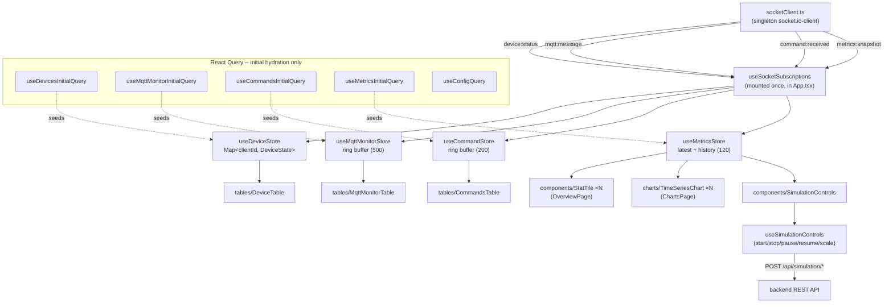
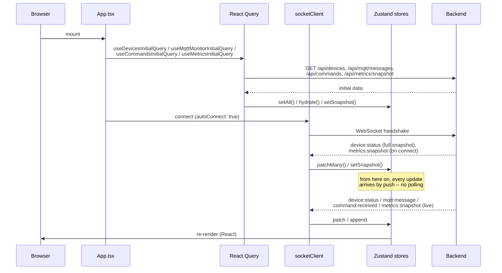
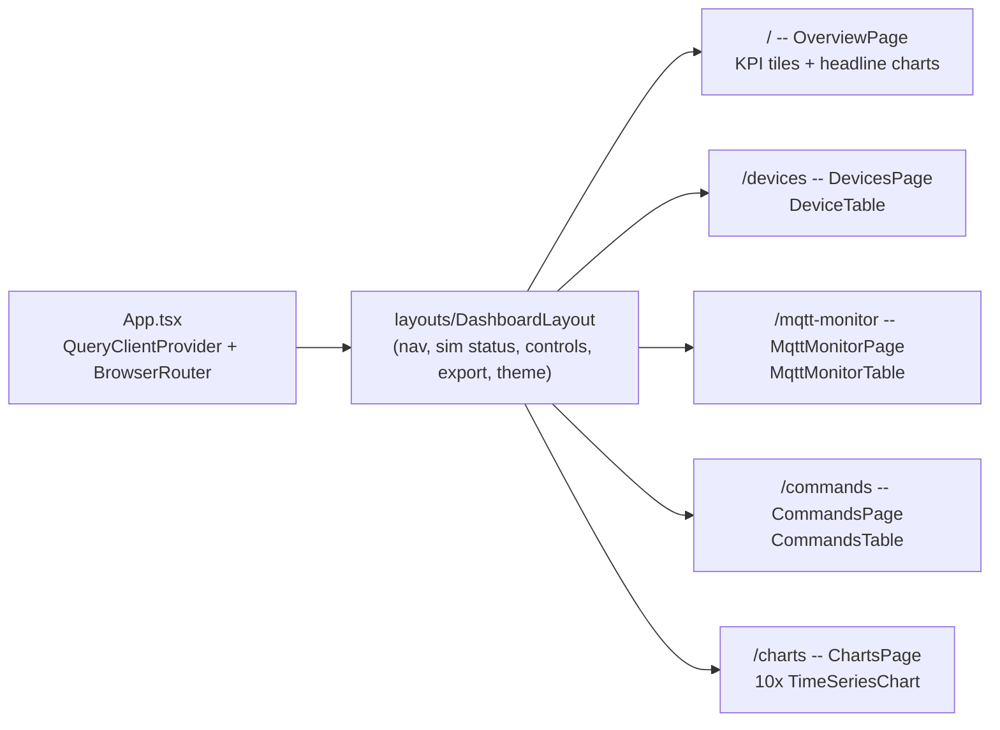
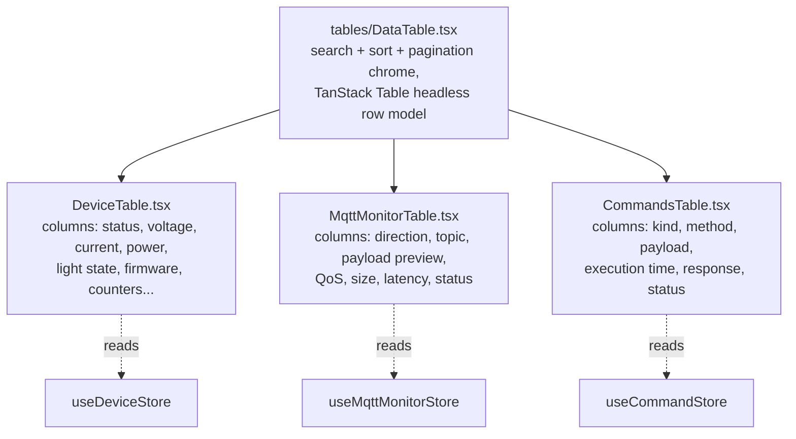

# Frontend Architecture

The frontend is a React/Vite/TypeScript dashboard (HeroUI + Tailwind v4 for components, Recharts
for charts, TanStack Table for the data grids, Zustand for live state, React Query for REST
hydration/mutations) that visualizes the backend's fleet of simulated devices in real time.

See the [root README](../../README.md) for how to run it and its `.env` reference. This document
is the internal architecture: how data actually flows from the backend into the UI, as Mermaid
diagrams.

## The core rule: live data lives in Zustand, REST only hydrates and controls

`useSocketSubscriptions` (mounted once at the app root) is the **only** place that touches the
socket. Every page/table/chart reads from a Zustand store; nothing else subscribes to Socket.IO
events directly. React Query is used for two things only: painting each store before the socket's
own initial snapshot arrives, and simulation-control mutations (start/stop/pause/resume/scale).

## Initial page load

## Pages and routing

## Table architecture

Every live table shares one chrome component (`tables/DataTable.tsx`) built on TanStack Table's
headless row model rendering a plain `<table>` -- not HeroUI's `Table` component, since HeroUI's
`Table` owns its own row/cell markup that doesn't compose with `flexRender`. Each concrete table is
just a column-definition file plus a store selector.

Pagination caps rendered DOM rows regardless of fleet size, so this scales without virtualization
for the device counts this tool targets (tens of thousands, sharded across the backend's worker
pool -- see [`backend/docs/ARCHITECTURE.md`](../../backend/docs/ARCHITECTURE.md)).

## Directory reference

| Path | Responsibility |
|---|---|
| `types/` | hand-written TS types mirroring the backend's models (kept in sync manually -- separate packages) |
| `websocket/socketClient.ts` | singleton `socket.io-client` instance |
| `store/` | Zustand stores for push-driven live data: `useDeviceStore`, `useMqttMonitorStore`, `useCommandStore`, `useMetricsStore` |
| `hooks/` | `useSocketSubscriptions` (the only socket consumer) + React Query hooks for initial hydration and simulation-control mutations |
| `lib/` | `api.ts` (fetch helpers, `API_URL`), `format.ts` (number/byte/latency formatting), `rateSeries.ts` (derives per-second rates from cumulative metrics history) |
| `components/` | `StatTile`, `ConnectionStatusBadge`, `SocketConnectionIndicator`, `SimulationControls`, `ExportButtons`, `ThemeToggle` |
| `charts/TimeSeriesChart.tsx` | one reusable Recharts line chart, single axis only (no dual-axis charts anywhere) |
| `tables/` | `DataTable.tsx` (shared chrome) + the three column-definition files |
| `pages/` | `OverviewPage`, `DevicesPage`, `MqttMonitorPage`, `CommandsPage`, `ChartsPage` |
| `layouts/DashboardLayout.tsx` | header (nav, sim status, start/stop/pause/resume/rescale, export, theme) + router outlet |
